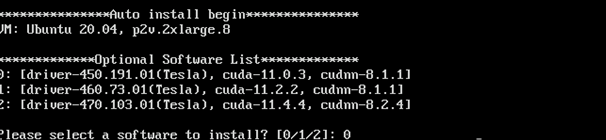
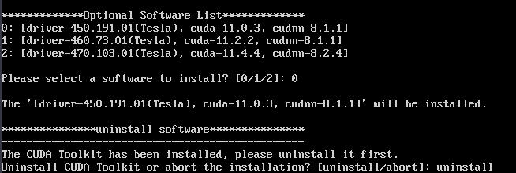
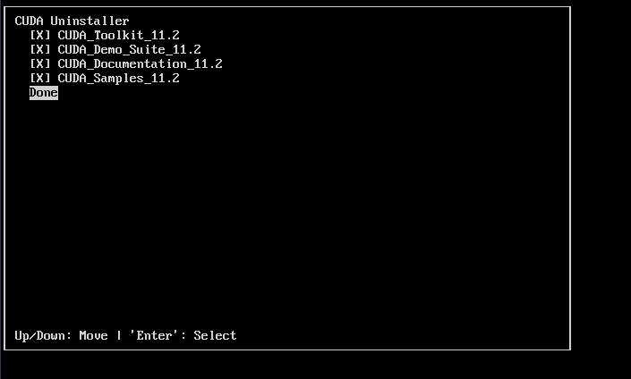
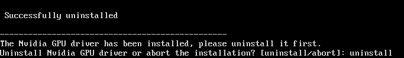
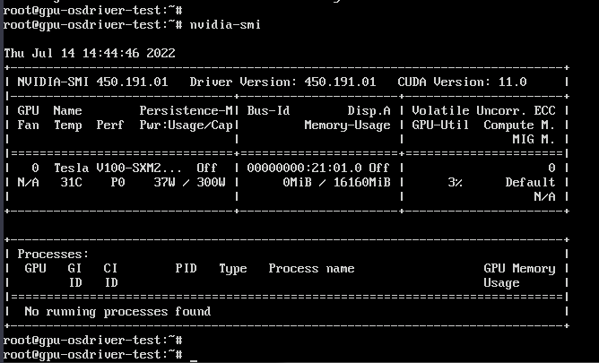
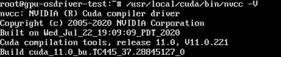
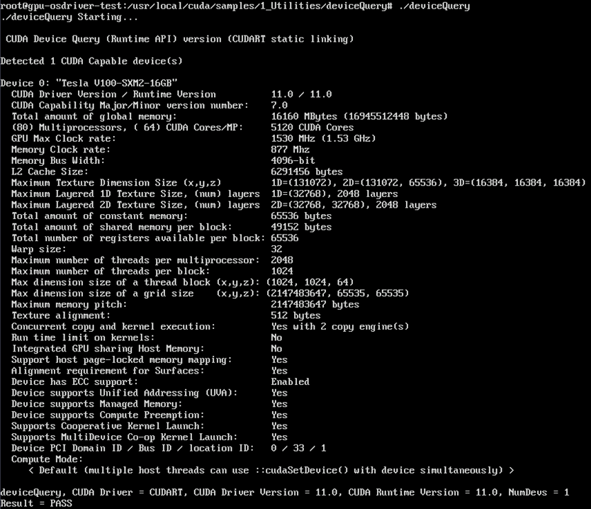

# （推荐）GPU加速型实例自动安装GPU驱动（Linux）<a name="ecs_03_0199"></a>

## 操作场景<a name="section922983752014"></a>

在使用GPU加速型实例时，需确保实例已安装GPU驱动，否则无法获得相应的GPU加速能力。

本节内容介绍如何在GPU加速型Linux实例上通过脚本自动安装GPU驱动。

## 使用须知<a name="section163613118219"></a>

-   本操作仅支持Linux操作系统。
-   本操作当前仅支持安装Tesla驱动。
-   如果GPU加速型实例已安装GPU驱动，需要先卸载原驱动后再安装新的目标驱动。

    GPU驱动自动安装脚本提供卸载驱动的能力，请在执行脚本时根据交互式界面按需选择。

-   GPU驱动安装成功后，实例会自动重启。
-   仅部分Linux公共镜像支持通过脚本自动安装GPU驱动，如下所示：

    -   CentOS 7.6、CentOS 7.9、CentOS 8.2。
    -   Ubuntu 18.04、Ubuntu 20.04、Ubuntu22.04。

    如果在支持的Linux公共镜像中没有您需要的操作系统及版本，请参考[GPU加速型实例安装Tesla驱动及CUDA工具包](GPU加速型实例安装Tesla驱动及CUDA工具包.md)，手动安装GPU驱动。

-   如果您使用的是私有镜像，请确保镜像已安装了Cloud-init组件及安装GPU驱动所需的依赖，且需使用驱动脚本所支持的Linux操作系统及版本。
-   请根据[表1](#table048010520222)选择需要的驱动安装包版本。

    **表 1**  支持的GPU驱动版本

    <a name="table048010520222"></a>
    <table><thead align="left"><tr id="row184801652172219"><th class="cellrowborder" valign="top" width="33.33333333333333%" id="mcps1.2.4.1.1"><p id="p1048015216221"><a name="p1048015216221"></a><a name="p1048015216221"></a>CUDA软件版本</p>
    </th>
    <th class="cellrowborder" valign="top" width="33.33333333333333%" id="mcps1.2.4.1.2"><p id="p34804523229"><a name="p34804523229"></a><a name="p34804523229"></a>Driver软件版本</p>
    </th>
    <th class="cellrowborder" valign="top" width="33.33333333333333%" id="mcps1.2.4.1.3"><p id="p10480185262213"><a name="p10480185262213"></a><a name="p10480185262213"></a>CuDNN软件版本</p>
    </th>
    </tr>
    </thead>
    <tbody><tr id="row17480155218223"><td class="cellrowborder" valign="top" width="33.33333333333333%" headers="mcps1.2.4.1.1 "><p id="p11480125215225"><a name="p11480125215225"></a><a name="p11480125215225"></a>10.2</p>
    </td>
    <td class="cellrowborder" valign="top" width="33.33333333333333%" headers="mcps1.2.4.1.2 "><p id="p18481452192210"><a name="p18481452192210"></a><a name="p18481452192210"></a>440.118.02</p>
    </td>
    <td class="cellrowborder" valign="top" width="33.33333333333333%" headers="mcps1.2.4.1.3 "><p id="p15481152192211"><a name="p15481152192211"></a><a name="p15481152192211"></a>8.0.5</p>
    </td>
    </tr>
    <tr id="row204817528224"><td class="cellrowborder" valign="top" width="33.33333333333333%" headers="mcps1.2.4.1.1 "><p id="p11481115222213"><a name="p11481115222213"></a><a name="p11481115222213"></a>11.0</p>
    </td>
    <td class="cellrowborder" valign="top" width="33.33333333333333%" headers="mcps1.2.4.1.2 "><p id="p748125252210"><a name="p748125252210"></a><a name="p748125252210"></a>450.191.01</p>
    </td>
    <td class="cellrowborder" valign="top" width="33.33333333333333%" headers="mcps1.2.4.1.3 "><p id="p134811252162214"><a name="p134811252162214"></a><a name="p134811252162214"></a>8.1.1</p>
    </td>
    </tr>
    <tr id="row1848165212220"><td class="cellrowborder" valign="top" width="33.33333333333333%" headers="mcps1.2.4.1.1 "><p id="p124815523225"><a name="p124815523225"></a><a name="p124815523225"></a>11.2</p>
    </td>
    <td class="cellrowborder" valign="top" width="33.33333333333333%" headers="mcps1.2.4.1.2 "><p id="p7481452102210"><a name="p7481452102210"></a><a name="p7481452102210"></a>460.73.01</p>
    </td>
    <td class="cellrowborder" valign="top" width="33.33333333333333%" headers="mcps1.2.4.1.3 "><p id="p134811752192210"><a name="p134811752192210"></a><a name="p134811752192210"></a>8.1.1</p>
    </td>
    </tr>
    <tr id="row1548165219220"><td class="cellrowborder" valign="top" width="33.33333333333333%" headers="mcps1.2.4.1.1 "><p id="p17481452122219"><a name="p17481452122219"></a><a name="p17481452122219"></a>11.4</p>
    </td>
    <td class="cellrowborder" valign="top" width="33.33333333333333%" headers="mcps1.2.4.1.2 "><p id="p1048125218229"><a name="p1048125218229"></a><a name="p1048125218229"></a>470.103.01</p>
    </td>
    <td class="cellrowborder" valign="top" width="33.33333333333333%" headers="mcps1.2.4.1.3 "><p id="p20481125214229"><a name="p20481125214229"></a><a name="p20481125214229"></a>8.2.4</p>
    </td>
    </tr>
    </tbody>
    </table>

## 驱动安装脚本支持区域及获取方式<a name="section14165102314255"></a>

您可以通过执行以下命令，获取驱动安装脚本。

-   华北-北京一

    ```
    wget -t 10 --timeout=10 https://hgcs-drivers-cn-north-1.obs.cn-north-1.myhuaweicloud.com/release/script/auto_install.sh && bash auto_install.sh
    ```

-   华北-北京二

    ```
    wget -t 10 --timeout=10 https://hgcs-drivers-cn-north-2.obs.cn-north-2.myhuaweicloud.com/release/script/auto_install.sh && bash auto_install.sh
    ```

-   华北-北京四

    ```
    wget -t 10 --timeout=10 https://hgcs-drivers-cn-north-4.obs.cn-north-4.myhuaweicloud.com/release/script/auto_install.sh && bash auto_install.sh
    ```

-   华北-乌兰察布一

    ```
    wget -t 10 --timeout=10 https://hgcs-drivers-cn-north-9.obs.cn-north-9.myhuaweicloud.com/release/script/auto_install.sh && bash auto_install.sh
    ```

-   华东-上海一

    ```
    wget -t 10 --timeout=10 https://hgcs-drivers-cn-east-3.obs.cn-east-3.myhuaweicloud.com/release/script/auto_install.sh && bash auto_install.sh
    ```

-   华东-上海二

    ```
    wget -t 10 --timeout=10 https://hgcs-drivers-cn-east-2.obs.cn-east-2.myhuaweicloud.com/release/script/auto_install.sh && bash auto_install.sh
    ```

-   华南-广州

    ```
    wget -t 10 --timeout=10 https://hgcs-drivers-cn-south-1.obs.cn-south-1.myhuaweicloud.com/release/script/auto_install.sh && bash auto_install.sh
    ```

-   华南-广州-友好用户环境

    ```
    wget -t 10 --timeout=10 https://hgcs-drivers-cn-south-4.obs.cn-south-4.myhuaweicloud.com/release/script/auto_install.sh && bash auto_install.sh
    ```

-   西南-贵阳一

    ```
    wget -t 10 --timeout=10 https://hgcs-drivers-cn-southwest-2.obs.cn-southwest-2.myhuaweicloud.com/release/script/auto_install.sh && bash auto_install.sh
    ```

-   中国-香港

    ```
    wget -t 10 --timeout=10 https://hgcs-drivers-ap-southeast-1.obs.ap-southeast-1.myhuaweicloud.com/release/script/auto_install.sh && bash auto_install.sh
    ```

-   亚太-曼谷

    ```
    wget -t 10 --timeout=10 https://hgcs-drivers-ap-southeast-2.obs.ap-southeast-2.myhuaweicloud.com/release/script/auto_install.sh && bash auto_install.sh
    ```

-   亚太-新加坡

    ```
    wget -t 10 --timeout=10 https://hgcs-drivers-ap-southeast-3.obs.ap-southeast-3.myhuaweicloud.com/release/script/auto_install.sh && bash auto_install.sh
    ```

-   非洲-约翰内斯堡

    ```
    wget -t 10 --timeout=10 https://hgcs-drivers-af-south-1.obs.af-south-1.myhuaweicloud.com/release/script/auto_install.sh && bash auto_install.sh
    ```

## 操作步骤<a name="section19871421172610"></a>

以下操作以Ubuntu 20.04 64bit操作系统，P2v规格的GPU加速型实例安装CUDA 11.0对应的Tesla驱动为例进行介绍。

1.  以root账号远程登录云服务器。

1.  执行以下命令，获取驱动安装脚本并运行。

    **wget -t 10 --timeout=10  _https://hgcs-drivers-cn-east-2.obs.cn-east-2.myhuaweicloud.com_/release/script/auto\_install.sh && bash auto\_install.sh**

1.  根据界面提示，选择需要安装的驱动版本。

    **图 1**  选择驱动安装版本<a name="fig125091112357"></a>  
    

2.  卸载已安装驱动。

    如果云服务器已安装过驱动，请根据提示先执行驱动卸载操作。

    如果云服务器本身未安装驱动，脚本会自动跳过该步骤，开始进行驱动安装。

    1.  卸载CUDA Toolkit。

        **图 2**  卸载CUDA Toolkit（1）<a name="fig20895633913"></a>  
        

        **图 3**  卸载CUDA Toolkit（2）<a name="fig2099353523918"></a>  
        

    2.  卸载GPU driver。

        **图 4**  卸载GPU driver<a name="fig47963211419"></a>  
        

    > **说明：** 
    >卸载完成后，开始安装驱动，此过程会持续几分钟，请耐心等待。

3.  驱动安装完成后，会自动重启云服务器后，请重新以root账号登录。

1.  执行以下命令，检查驱动是否安装成功。

    **nvidia-smi**

    如果返回信息中包含了已安装的驱动版本，说明驱动安装成功。

    **图 5**  查看驱动安装结果<a name="fig1814617564917"></a>  
    

2.  执行以下命令，检查CUDA版本是否正确。

    **/usr/local/cuda/bin/nvcc -V**

    **图 6**  检查CUDA版本<a name="fig383893485616"></a>  
    

3.  （可选）检查CUDA是否正常。
    1.  执行以下命令，进入“/usr/local/cuda/samples/1\_Utilities/deviceQuery”目录。

        **cd /usr/local/cuda/samples/1\_Utilities/deviceQuery**

    2.  执行以下命令，自动编译deviceQuery程序。

        **make**

    3.  执行以下命令，查看CUDA是否安装成功。

        **./deviceQuery**

        如果返回信息中有CUDA的版本信息，则表明CUDA安装成功。

        **图 7**  查看CUDA安装结果<a name="fig940173116549"></a>  
        

