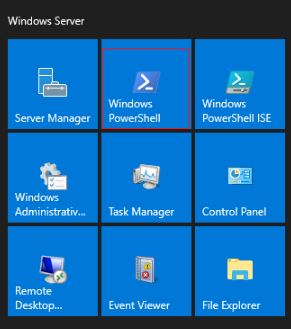
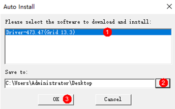
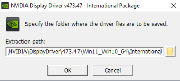
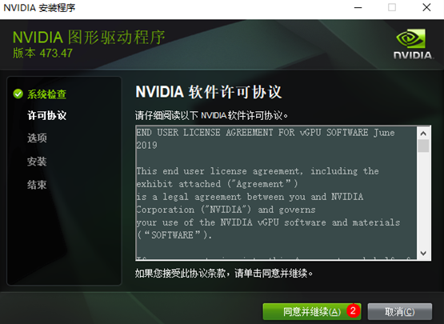
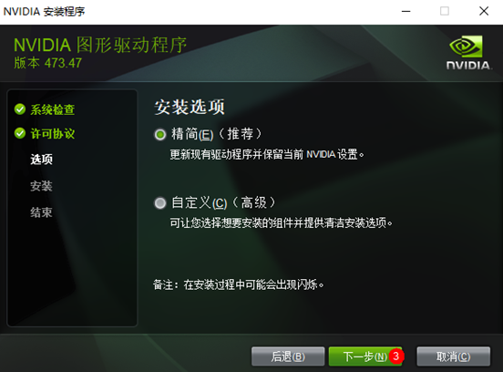
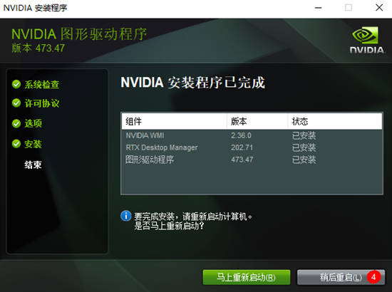
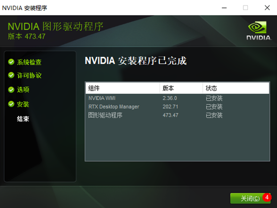

# （推荐）GPU加速型实例自动安装GPU驱动（Windows）<a name="ecs_03_0222"></a>

## 操作场景<a name="section922983752014"></a>

在使用GPU加速型实例时，需确保实例已安装GPU驱动，否则无法获得相应的GPU加速能力。

本节内容介绍如何在GPU加速型Windows实例上通过脚本自动安装GPU驱动。

## 使用须知<a name="section163613118219"></a>

-   如果GPU加速型实例已安装GPU驱动，需要先卸载原驱动后再安装新的目标驱动。
-   当前仅部分GPU加速型实例的规格、部分Windows操作系统版本支持通过脚本自动安装GPU驱动。

    -   Windows Server 2016 数据中心版
    -   Windows Server 2019 数据中心版

    如果您的规格、操作系统或驱动版本不支持通过脚本自动安装GPU驱动，请参考[GPU加速型实例安装GRID驱动](GPU加速型实例安装GRID驱动.md)和[GPU加速型实例安装Tesla驱动及CUDA工具包](GPU加速型实例安装Tesla驱动及CUDA工具包.md)，手动安装GPU驱动。


## 驱动安装脚本支持区域及获取方式<a name="section14165102314255"></a>

您可以在PowerShell上执行以下命令，获取驱动安装脚本。

-   华北-北京一

    ```
    Start-BitsTransfer -Source https://hgcs-drivers-cn-north-1.obs.cn-north-1.myhuaweicloud.com/release/script/auto_install.ps1 -Destination auto_install.ps1; ./auto_install.ps1
    ```

-   华北-北京二

    ```
    Start-BitsTransfer -Source https://hgcs-drivers-cn-north-2.obs.cn-north-2.myhuaweicloud.com/release/script/auto_install.ps1 -Destination auto_install.ps1; ./auto_install.ps1
    ```

-   华北-北京四

    ```
    Start-BitsTransfer -Source https://hgcs-drivers-cn-north-4.obs.cn-north-4.myhuaweicloud.com/release/script/auto_install.ps1 -Destination auto_install.ps1; ./auto_install.ps1
    ```

-   华北-乌兰察布一

    ```
    Start-BitsTransfer -Source https://hgcs-drivers-cn-north-9.obs.cn-north-9.myhuaweicloud.com/release/script/auto_install.ps1 -Destination auto_install.ps1; ./auto_install.ps1
    ```

-   华东-上海一

    ```
    Start-BitsTransfer -Source https://hgcs-drivers-cn-east-3.obs.cn-east-3.myhuaweicloud.com/release/script/auto_install.ps1 -Destination auto_install.ps1; ./auto_install.ps1
    ```

-   华东-上海二

    ```
    Start-BitsTransfer -Source https://hgcs-drivers-cn-east-2.obs.cn-east-2.myhuaweicloud.com/release/script/auto_install.ps1 -Destination auto_install.ps1; ./auto_install.ps1
    ```

-   华南-广州

    ```
    Start-BitsTransfer -Source https://hgcs-drivers-cn-south-1.obs.cn-south-1.myhuaweicloud.com/release/script/auto_install.ps1 -Destination auto_install.ps1; ./auto_install.ps1
    ```

-   华南-广州-友好用户环境

    ```
    Start-BitsTransfer -Source https://hgcs-drivers-cn-south-4.obs.cn-south-4.myhuaweicloud.com/release/script/auto_install.ps1 -Destination auto_install.ps1; ./auto_install.ps1
    ```

-   西南-贵阳一

    ```
    Start-BitsTransfer -Source https://hgcs-drivers-cn-southwest-2.obs.cn-southwest-2.myhuaweicloud.com/release/script/auto_install.ps1 -Destination auto_install.ps1; ./auto_install.ps1
    ```

-   中国-香港

    ```
    Start-BitsTransfer -Source https://hgcs-drivers-ap-southeast-1.obs.ap-southeast-1.myhuaweicloud.com/release/script/auto_install.ps1 -Destination auto_install.ps1; ./auto_install.ps1
    ```

-   亚太-曼谷

    ```
    Start-BitsTransfer -Source https://hgcs-drivers-ap-southeast-2.obs.ap-southeast-2.myhuaweicloud.com/release/script/auto_install.ps1 -Destination auto_install.ps1; ./auto_install.ps1
    ```

-   亚太-新加坡

    ```
    Start-BitsTransfer -Source https://hgcs-drivers-ap-southeast-3.obs.ap-southeast-3.myhuaweicloud.com/release/script/auto_install.ps1 -Destination auto_install.ps1; ./auto_install.ps1
    ```

-   非洲-约翰内斯堡

    ```
    Start-BitsTransfer -Source https://hgcs-drivers-af-south-1.obs.af-south-1.myhuaweicloud.com/release/script/auto_install.ps1 -Destination auto_install.ps1; ./auto_install.ps1
    ```


## 操作步骤<a name="section19871421172610"></a>

以下操作以Windows Server 2019 数据中心版操作系统，G6规格的GPU加速型实例安装Grid驱动为例进行介绍。

1.  远程登录云服务器。

1.  单击“启动”，打开Windows PowerShell。

    **图 1**  打开PowerShell<a name="fig37704221519"></a>  
    

2.  在PowerShell中，执行以下命令，获取驱动安装脚本并运行。

    以“华北-北京四”为例介绍，更多区域请参考[驱动安装脚本支持区域及获取方式](#section14165102314255)。

    **Start-BitsTransfer -Source https://hgcs-drivers-cn-north-4.obs.cn-north-4.myhuaweicloud.com/release/script/auto\_install.ps1 -Destination auto\_install.ps1; ./auto\_install.ps1**


1.  选择驱动版本与保存路径。

    **图 2**  选择驱动版本与保存路径<a name="fig1341524132811"></a>  
    

2.  单击“OK”，开始安装驱动。

    **图 3**  安装驱动<a name="fig15730341102813"></a>  
    

    **图 4**  同意NVIDIA软件许可协议<a name="fig1951905290"></a>  
    

    **图 5**  选择安装选项<a name="fig107761811102915"></a>  
    

3.  驱动安装完成后，可能需要重启云服务器。
    1.  如果需要重启，单击“稍后重启”，待脚本执行完成后，手动重启云服务器。

        **图 6**  稍后重启<a name="fig116661637193213"></a>  
        

    2.  如果不需要重启，单击“关闭”。

        **图 7**  关闭<a name="fig11103181153316"></a>  
        

4.  返回桌面，在空白处右键单击，选择“NVIDIA控制面板”，查看驱动版本，判断驱动是否安装成功。

    若显示如下版本，表示驱动安装成功。

    **图 8**  驱动版本<a name="fig19371215348"></a>  
    


